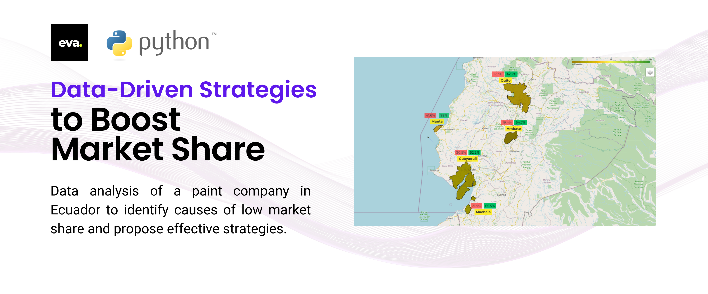
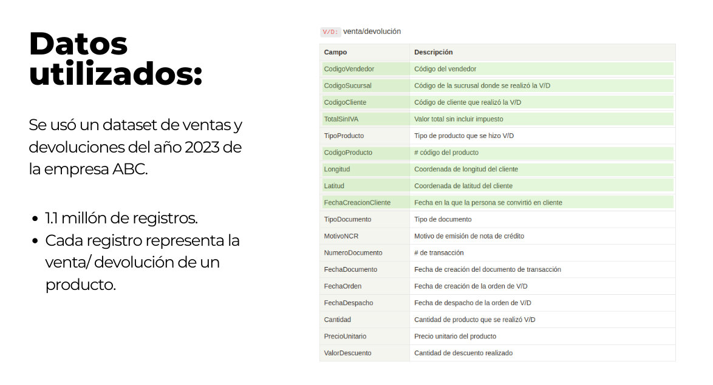
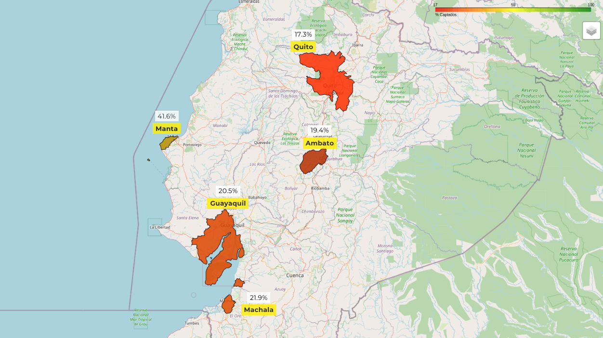
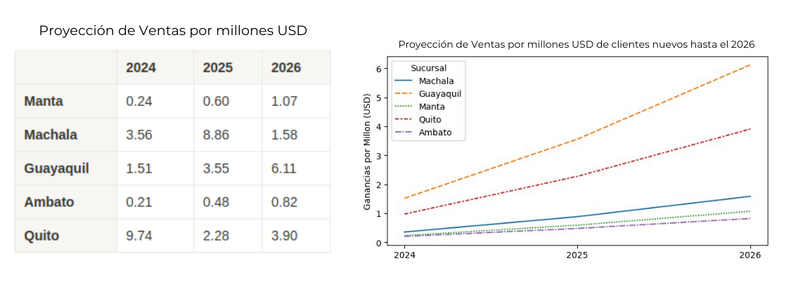

 
# PaintMarket Insights: Data-Driven Strategies to Boost Market Share

## De Pinceladas a Resultados

## Introducción

Análisis detallado de datos de una empresa de pinturas a nivel nacional para identificar causas de baja cuota de mercado y proponer estrategias efectivas. Utilizando técnicas avanzadas de análisis de datos, se busca optimizar el rendimiento de los vendedores y aumentar la captación de clientes.

## Empresa ABC

- Dedicada a la venta de pinturas a nivel nacional.
- Posicionamiento fuerte de la marca en el país.

## Datos Utilizados

## Análisis por Sucursales

- **Guayaquil**: 41.6% de las ventas
- **Manta**: 19.4% de las ventas
- **Ambato**: 17.3% de las ventas
- **Quito**: 20.5% de las ventas
- **Machala**: 21.9% de las ventas

## Estadísticas Generales (2023)

- Ventas totales: $55 millones
- Clientes: 2883
- Vendedores: 48
- Nuevos clientes: 213
- Sucursales: 5

## Estrategias Propuestas

### Captación de Nuevos Clientes

- Propuesta: Cada vendedor capte 2 nuevos clientes cada año durante los próximos 3 años.
- Resultados esperados:
- Incremento en la cantidad de ventas por fidelidad de nuevos clientes.
- Aumento significativo en las ventas proyectadas hasta el 2026.

### Proyección de Ventas (2026)

- Ventas totales: $68 millones
- Clientes: 4266
- Nuevos clientes: 1383
- Sucursales: 5

## Conclusión

Las estrategias basadas en datos permiten identificar oportunidades clave para mejorar la cuota de mercado. Implementando las recomendaciones, se espera un crecimiento sostenido en ventas y captación de clientes.

## Agradecimientos

¡Gracias por su atención!

---

Para más detalles, consulte el informe completo en PDF: [Informe Completo](/Presentacion%20Proyecto.pdf)